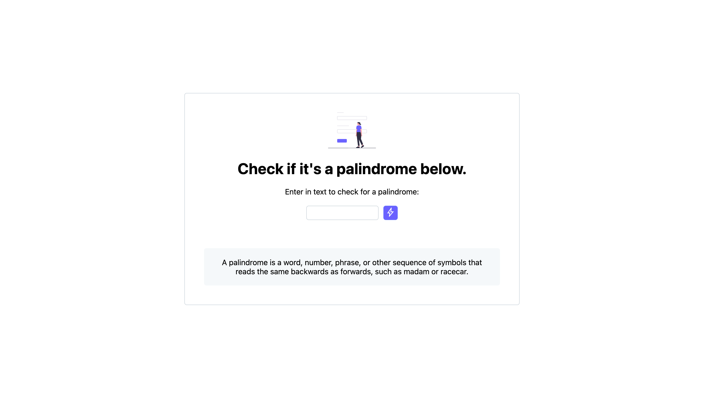

## Palindrome Checker - an fCC JavaScript project
 📎 This is a freeCodeCamp JavaScript certification project. For this project, I had to make a palindrome checker, which accepts an input and tells the user if their input is, or is not, a palindrome.

 🎨 As this was a project to test my JavaScript, fCC didn't care about how I designed the project, as long as the functionality was there. However, I decided to try and make it look somewhat good, so I designed it to look a little like GitHub. It includes some colours from their [design system](https://primer.style/) and the 'bolt' icon is a Material Symbol from Google.

 [**View live site**](https://samhlking.github.io/palindrome-checker/)

## How it works
- Alerts user if they attempt to submit empty input
- If there is an input, runs calc function
    - Also accepts 'enter' key as a 'button press'
- The function:
    - Removes special characters, spaces etc. so input becomes just numbers and letters, which then become lowercase
    - Compares this original reformatted input to a reversed version, which was created using:
    ```
    const inputReversed = [...input].reverse().join('');
    ```
    - If they match, they are a palindrome, else they are not, and updates the ```results``` text.